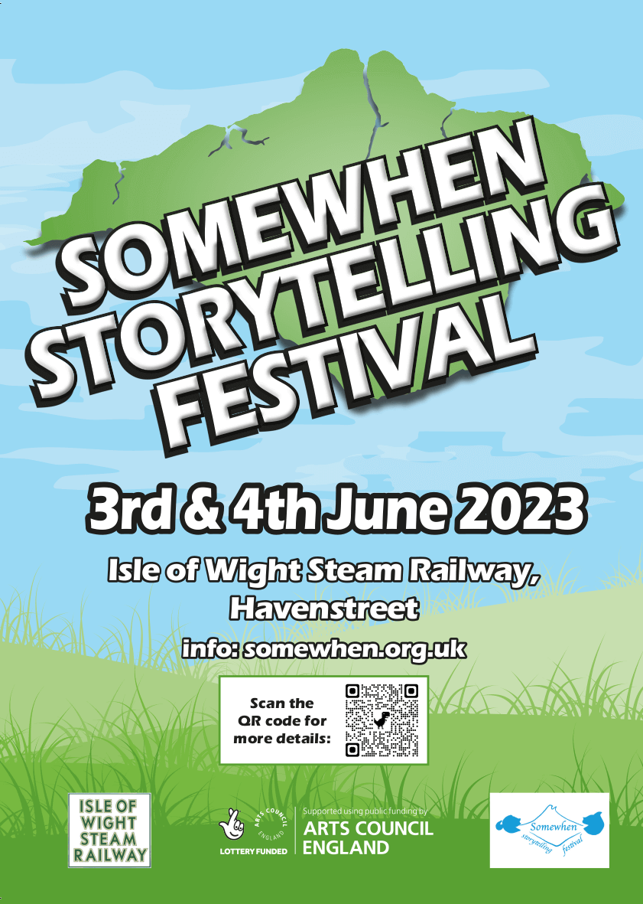

*Somewhenever* is a year long series of storytelling events taking place somewhen throughout 2023 on the beautiful island of the Isle of Wight, just off the south coast of England.

<strong><a href="./somewhen-festival-2023"> &gt;&gt;&gt; SOMEWHEN FESTIVAL 2023 WEBSITE &lt;&lt;&lt; </a>&nbsp;&nbsp;&nbsp; <a href="https://www.ticketsource.co.uk/somewhen-storytelling-festival"> &gt;&gt;&gt; SOMEWHEN FESTIVAL 2023 TICKETS &lt;&lt;&lt; </a></strong>

  

  

<strong><a href="https://www.ticketsource.co.uk/somewhen-storytelling-festival"> &gt;&gt;&gt; SOMEWHEN FESTIVAL 2023 TICKETS &lt;&lt;&lt; </a> &nbsp;&nbsp;&nbsp; <a href="./somewhen-festival-2023"> &gt;&gt;&gt; SOMEWHEN FESTIVAL 2023 WEBSITE &lt;&lt;&lt; </a></strong>

  

The events kick off with the first [*Somewhen Storytelling Festival, 2023*](./somewhen-festival-2023), a two day, non-camping storytelling festival with storytelling sessions aimed specifically at adults, and plenty for children too. Come and join us on the first weekend of June (June 3rd-4th, 2023) at the [Isle of Wight Steam Railway](https://iwsteamrailway.co.uk/), Havenstreet.

__ALSO BOOKING — SOMEWHEN EVENTS AT VENTNOR FRINGE__

<h3><a href="https://vfringe.co.uk/events/dark-tales-from-the-woods/">DANIEL MORDEN — DARK TALES FROM THE WOODS</a></h3>

__A hundred years ago the famous Welsh gypsy family the Woods told wild fairy tales around the fire- tales of shapeshifting and magic and drama and danger.__

Now, award-winning storyteller DANIEL MORDEN retells those thrilling tales with wit, passion and gusto.

In 2017 Daniel was awarded the Hay Festival Medal for his services to storytelling.

_“Gruesome, fantastical and hypnotic, Morden’s stories show why fairytales will never lose their power over our imaginations.” – `The Times`_

*This performance of 'Dark Tales from the Woods' is promoted by the Island Storytellers as part of __Somewhen__, a year-long celebration of storytelling, funded by an Arts Council National Lottery Project Grant.*

[__Tickets now available for purchase__](https://thelittleboxoffice.com/ventnorexchange/book/event/180553) *(£10, Culture / Unlimited Pass 2for1)*

