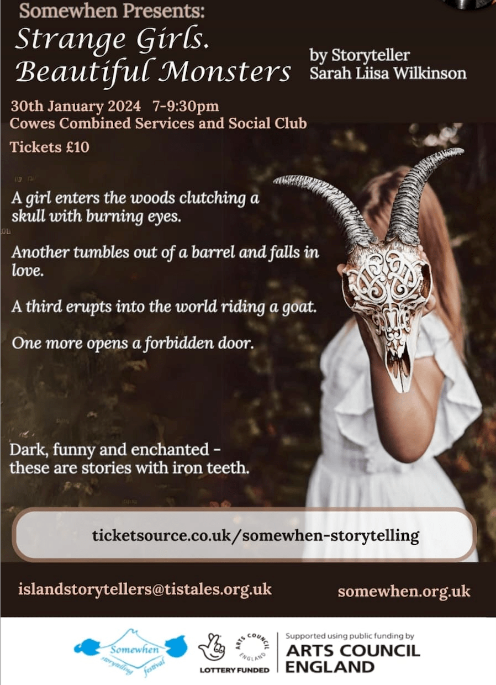
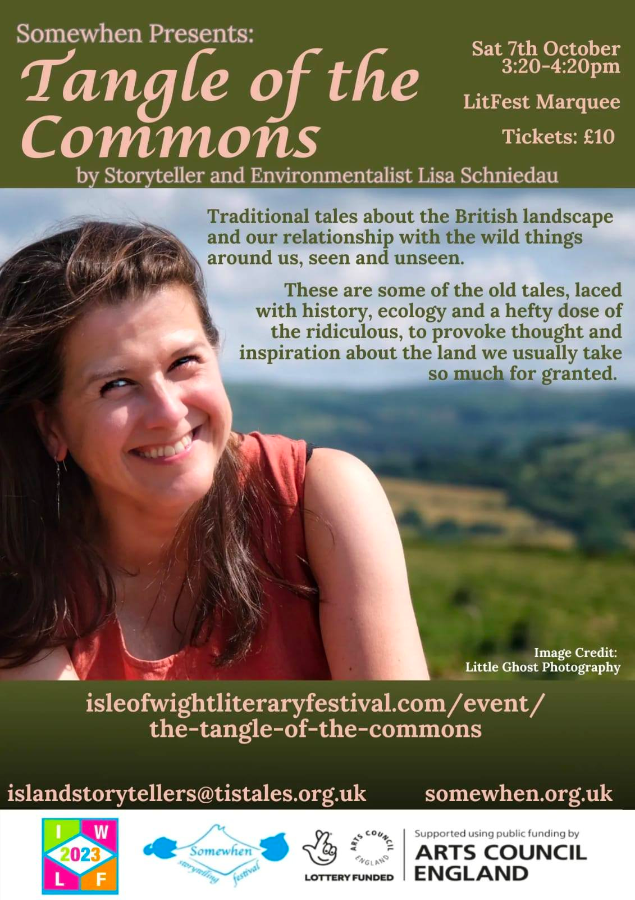
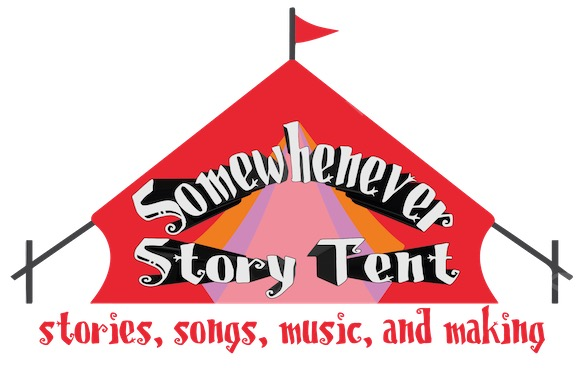

"Somewhenever" was originally a year long Arts Council/National Lottery funded series of storytelling events and activities taking place somewhen throughout 2023 somewhere and everywhere on the beautiful island of the Isle of Wight, just off the south coast of England.

As we continue to build storytelling audiences and practice on the Island with regular storytelling events under more general banners, we're hoping to bring the "Somewhen" umbrella (hmm... maybe we should get some umbrella merch?!) back in a more formal way sometime soon...

For now, the best best to keep up to date with our storytelling activities is on the ['Tis Tales website](https://tistales.org.uk) — `https://tistales.org.uk`

__*Tellers, not readers.* Spoken, not read. *Not (just) for children.*__

 

<h2>***UPCOMING****</h2>

<h3 id="twelve-days-cowes-2024">Twelve Days of Christmas, Cowes, 2024</h3>

<h4>Twelve Days of Christmas Window Spotting Competition, Cowes, December 2024</h4>

Print off the forms here:

Items to spot:

## Previous Events

<h3 id="np-choyd-2024">Nell Phoenix — Little Red Riding Hood and Other Lost Girls — Auguest 3rd, 7pm — Yarmouth</h3>

Tickets: <a href="https://www.ticketsource.co.uk/somewhen-storytelling">available here</a>.

<h3 id="sw-chale-2024">Somewhenever Storytelling Tent — Chale Show — August 3rd/4th 2024, 11-5 — Chale</h3>

For a second year in a row, we're delighted to be hosting the Somewhen Storyelling Tent at Chale Show, Sat/Sun August 3rd/4th, 2024.

Here is the provided schedule formatted into a Markdown table:

### Saturday 3rd August ’24 11-4pm

| Time  | Storytelling/Activity                          | Aimed at | Led by        |
|-------|------------------------------------------------|----------|---------------|
| 11:00 | Opening tales - Porridge and pots              | All      | Sue Bailey    |
| 11:30 | Musical stories                                | 3+       | Izzy Norwood  |
| 12:00 | Monsters and mayhem                            | 8+       | Nell Phoenix  |
| 12:30 | Circus skills                                  | All      | Alicia Dent   |
| 1:00  | Kings, coins and Chickens                      | 5+       | Holly Medland |
| 1:30  | Tales from the sea                             | 4+       | Sue Clark     |
| 2:00  | Magical Gardens                                | 4+       | Nell Phoenix  |
| 2:30  | Musical stories                                | 3+       | Izzy Norwood  |
| 3:00  | Circus skills (outside the tent) / Myths and magic transformations (inside tent) | All / 7+ | Alicia Dent / Sylvia Clare |
| 3:30  | Stylish Stories                                | 5+       | Holly Medland |
| 4:00  | Closing tales – Beds and Byes                  | All      | Sue Bailey    |

### Sunday 4th August ’24 11-4pm

| Time  | Storytelling/Activity                          | Aimed at | Led by        |
|-------|------------------------------------------------|----------|---------------|
| 11:00 | Tales from the sea                             | 4+       | Sue Clark     |
| 11:30 | Jack the lad’s dreaming                        | 8+       | Monty Hirst   |
| 12:00 | Magical gardens                                | 4+       | Nell Phoenix  |
| 12:30 | Sing some stories                              | 3+       | Bev Barber    |
| 1:00  | Stylish stories                                | 5+       | Holly Medland |
| 1:30  | Porridge and pots                              | 3+       | Sue Bailey    |
| 2:00  | Monsters and mayhem                            | 7+       | Nell Phoenix  |
| 2:30  | Sing some stories                              | 3+       | Bev Barber    |
| 3:00  | King’s chickens and coins                      | 5+       | Holly Medland |
| 3:30  | Island Tales                                   | 8+       | Monty Hirst   |
| 4:00  | Chillout tales                                 | All      | Anyone        |

<h3>Ventnor Fringe 2024 — Storytelling Festival within a Fringe</h3>

<h4 id="slw-vf-2024">Sara Liisa Wilkinson — CANCELLED — The Girl and the Snake Witch</h4>

<h4 id="tt-vf-2024">'Tis Tales</h4>

<h4 id="slw-snh-2024">Stories'n'Harp — Tales of Britain & Ireland</h4>

<h4 id="slw-hm-2024">Holly Medland — Middle Age Crisis</h4>

<h4 id="slw-nvf-2024">Island Storytellers — Seven Ages</h4><

<h4 id="slw-nvf-2024">Sue Bailey — </h4>

<h3 id="cm-nsciw-2024">CLAIRE MURPHY / UniVerse.</h3>

A mathematician finds a gift from a god.
Blacksmiths beat out the music of the spheres.
And why are there turtles everywhere?

Where does myth meet science? Is it only in the middle of the night when we half wake and half sleep? In this timeless place of wonder and insight, time stretches and a fissure opens that builds a dream bridge between many worlds…

Venue: Quay Arts, Newport
Date: Tue 5th March 2024
Time: Cafe / Bar open from 18:00, performance from 19:00
Tickets: [£10 + £1.75 booking fee](https://uk.patronbase.com/_QuayArts/Productions/3EUR/Performances)

[Clare Murphy](https://claremurphy.org/),internationally renowned storyteller, performer, teacher, salon curator, artist in residence.  A woman of many skills, Born into a family of performers and poets, her storytelling career began in 2006. Since then she has told all kinds of stories from ancient myths to modern quantum physics, playing world stages from NASA Jet Propulsion Laboratory Pasadena to the National Theatre London.  Her storytelling work goes beyond performance into the realm of teaching, training and consulting worldwide on a myriad of projects.

<h3 id="cm-nsciw-2024">Storytelling For Science
Educators Workshop</h3>

Clare Murphy, a highly respected international storyteller will be leading a storytelling workshop from 9.00-5pm on Wednesday 6th March at Quay Arts, Newport. It will focus on developing new and different ways to communicate.

Clare says: Whether you are a climate change scientist, a paramedic, a UN Policy maker, an academic, you need to be able to talk fluently about your work and make an impact on your audience.  

Storytelling skills will help you and your team improve your impact and message, no matter what sector you work in.

Clare trains teams and individuals worldwide on storytelling skills.  These skills include managing nerves, preparing presentations, connecting to audience, turning experience into story, story editing, adaptive story formats.  Clare also develops confidence, presence and vocal range, while all the time developing the individual skillset of each person.

The evening before, (Tuesday 5th March at 7pm) Clare will be telling "UniVerse" in the cafe at Quay Arts.  Clare highly recommends workshop participants attend the storytelling performance, as it will be referenced during the workshop.

The cost per person for the workshop should be £100 but this is subsidised by Arts Council funding so the cost to each participant will be £45. This includes a ticket for UniVerse.

This event was organised by the Island Storytellers who received a grant to develop storytelling on the Isle of Wight under the banner of Somewhen Storytelling. Please email islandstorytellers@tistales.org.uk to reserve a space.

Note, there were only 16 spaces on this course which were allocated on a first come first serve basis.

<h3 id="slw-nsw-2024">SARAH LIISA WILKINSON / STRANGE GIRLS. BEAUTIFUL MONSTERS.</h3>

A girl enters the woods clutching a skull with burning eyesAnother tumbles out of a barrel and falls in loveA third erupts into the world riding a goatOne more opens a forbidden door...Sarah Liisa Wilkinson invites you to meet some very strange girls and some very beguiling monsters from the fairytale forest. This is a world of Baba Yagas and bloodstained dolls, wide-eyed girls and spoon wielding sisters, lovestruck trolls, and lovers who hide monstrous secrets behind their charms.Dark, funny and enchanted – these are stories with iron teeth.

Venue: Cowes Combined Services & Social Club, Cowes, PO31 7AJ
Date: Tue 30th January 2024
Running time: 75 minutes
Tickets: [£10 (incl. booking fee)](https://www.ticketsource.co.uk/somewhen-storytelling/somewhen-presents-strange-girls-beautiful-monsters-by-sarah-liisa-wilkinson/e-bkmgrb)

Sarah Liisa Wilkinson is a storyteller who delights audiences with her always engaging, energetic and playful performance style. She has a particular interest in the folktales and myths of Finland and other Nordic lands, but loves to tell tales from all around the world. She has trained as a performer with Philippe Gaulier, and as a storyteller with Nell Phoenix and Ben Haggarty, and has told stories to people in the UK and internationally in theatres, clubs, pubs, festivals, churches, front rooms and all-night sleepovers. She is a member of The Embers Collective, a storytelling and music group in London.

<h3 id="ventnor-christmas-2023">PREVIOUSLY - TWELVE DAYS OF CHRISTMAS / SEASONAL TALES, VENTNOR, AND 'TIS TALES AT BOOJUM & SNARK</h3>

Many people are familiar with 'The Twelve days of Christmas', a cumulative song in which more and more gifts are given by 'my true love' each time you go round the song, and the basis for a feast of storytelling in Ventnor this Christmas time.

If you count up the individual gifts in the song, it comes to a grand total of 78 items. We may not manage that number of tales over the Christmas season, but that is the number of figures and animals made by members of the Island Storytellers to hide in upwards of fifty shop and business windows around Ventnor  as part of <a href="https://www.ventnorcarnival.org/">Ventnor Carnival Association</a>'s Christmas window spotting competition.

All the items will be in place by the 9th December, ready for the competition which runs from 9th-16th December. As part of the Ventnor celebrations, the Island Storytellers will be presenting two performances of stories connected to characters in the song on __Saturday, December 16th__ prior to the Illuminated Carnival. The first show will be at Ventnor Exchange at 11.30am and the second in St Catherine’s Church Meeting Room at 1.30pm. There will be tales about swans, golden rings, drummers, hens and more. Entry is by donation on the door, of food, or cash, or Christmas supplies, to <a href="https://www.ventnortowncouncil.gov.uk/directory/ventnor-community-foodbank/">Ventnor Community Foodbank</a>.

We're also hoping to bring some pop up storytelling to some of the shops involved in the window spotting competition. We won’t say where, or when but it will be, somewhen that day, somewhere, so if you're shopping in Ventnor that day, be prepared to be regaled with a tale or two.

*The window spotting competition is just one of many things being co-ordinated by Ventnor Carnival Association that are taking place in Ventnor on 16th December; there'll also be a craft fair, music, Santa's grotto, and the lantern parade, with the day's events culminating in a carol concert in Ventnor Park.*

The following day, on __Sunday, December 17th, 2023__, from 7pm, our very own storytelling trio that is <a href="https://tistales.org.uk/">'Tis Tales</a> will be joining the Stoutmas Festival at <a href="https://www.boojumandsnark.co.uk/events/">Boojum & Snark</a> in Sandown, with a set of even more seasonal tales.

We'll hopefully see you there, somewhen, somewhere...

<h3>LISA SCHNEIDAU AT IW LITERARY FESTIVAL, 2023</h3>

Tales and the land often go together, and Lisa’s tales are often steeped in the landscape and acutely aware of the local ecology.

Lisa's show, *Tangle of the Commons*, was performed on Saturday, October 7th, 2023, 3.20-4.20pm, Isle of Wight Literary Festival, (tickets priced £10). <!-- .-->

As befitted a show at the Isle of Wight Literary Festival, book merch was available in the form of Lisa’s three collections of folk tales: Botanical Folk Tales of Britain and Ireland, Woodland Folk Tales of Britain and Ireland, River Folk Tales of Britain and Ireland, all published by History Press. But this wasn’t your typical book tour reading. It was a proper storytelling show!

<h3>PREVIOUSLY — SOMEWHEN STORY TENT AT CHALE SHOW, SATURDAY AND SUNDAY, AUGUST 5TH-6TH, 2023, CHALE SHOWGROUND, ISLE OF WIGHT</h3>

Although the first day of the show was cancelled due to high winds, we were honoured to be able to bring some of our tales to one of the largest events on the Island calendar at Chale Show. We even had <a href="https://thechaleshow.co.uk/storytent/">our own tent</a>.

 

 

 
<h3>CHALE SHOW STORY TENT — 20 MIINUTES OF TALES TOLD, ON THE HOUR, EVERY HOUR, 11AM-4PM INCLUSIVE. TALES FOR ALL AGES, FOLLOWED BY FAMILY FRIENDLY ACTIVITIES ON THE HALF HOUR...</h3>
  

  

<h2>OVER FOR ANOTHER YEAR — SOMEWHEN EVENTS AT VENTNOR FRINGE, 2023</h2>

Giants, green dragons, wonder tales, sock hunts... The Island Storyteller's Somewhen team  brought a myriad of stories to Ventnor Fringe last week in a multitude of events. Internationally renowned storyteller Xanthe Gresham Knight enthralled the audience with her tales chosen by the audience; Xanthe had stepped in at the last moment as well-known storyteller, Daniel Morden, had been taken ill. Sue Bailey said, "It was great that Xanthe was able to come. We were looking for someone of a similar calibre to Daniel, and Xanthe pulled the stops out to fill the void with mesmerising stories and accordion playing".

Tony ‘Monty' Hirst hot-footed from a pop-up Somewhen Storytelling set at Calbourn Watermill's *Arthurian Weekend* to open up the feast of Somewhen storytelling events at the Fringe with another outing of 'Unforeseen Consequences', his set of slightly nonsensical tales where the outcome is not always expected! He said "The fringe is a fantastic opportunity for bringing traditional stories to new audiences. Storytelling was the standup of its day, and many of the tales work as well today as ever they did."

On the Wednesday midway through Fringe week, seven regulars people, from the Island Storytellers' monthly story round, took to the floor to tell tales linked by the word green. Sue continued "I loved the diversity of voices and styles at our ‘Green' storytelling at Ventnor Library. It really showed that stories come in many forms whether they are based on anecdotes, traditional folk tales  or even on impossibly probable animal stories. We rocked with laughter when local storyteller Sue Clark related  her story of how their caravanning group converted a car into a green dragon."

Stories continued on the final Friday, when <a href="https://tistales.org.uk/">TisTales</a>, a trio of local storytellers, regaled a packed audience at Ventnor Arts Club with tales of giants.  Holly Medland's tales of the origin of Britain gave a possible insight into the assertive nature of women on these islands today, as the heroine, Albina, encouraged the daughters of a Syrian king to rise up against the mundane and devaluing requirements of being obedient and subservient wives.

Welsh hero, Bendigeidfran ("Bran the Blessed"), Irish giant, Fionn mac Cumhail and Norse god, Thor, also featured in this excellent hour of stories.

On Saturday and Sunday Sue Bailey led one of her infamous and highly engaging storywalks. "One sock – a riddle and story filled sock hunt, is such fun"  said Sue. "The children are very sharp eyed and always manage to follow the clues and find all my missing socks. I love the way they work together and even though they are keen to be the finders, they make sure all the children taking part have a chance to find something".

As wll as ticketed performances, stories were also told as part of several free fringe sets in the Fringe Square.

Sue Bailey continued "It has been great being part of Ventnor Fringe.  We are very grateful to the organisers for providing a platform for all the performances,  whether they be local, national or international. Our storytelling events this week have been part of a year long lottery supported project called ‘Somewhen Storytelling'.

 

<h3><a href="https://vfringe.co.uk/events/dark-tales-from-the-woods/">XANTHE GRESHAM-KNIGHT — BAG OF WONDERS</a></h3>

Date: Wednesday 26th July 5-6pm  
Venue: Boniface Studios (The Hall)  

__Storytelling that's as sharp as a lemon and as sweet as a nut. Accept it or not, we're all hooked on our baggage system...__

...whether it's a clutch bag or a holdall. But forget what's in yours, and come and rummage around in Xanthe's bottomless bag. Between the kitchen sink and the old tube tickets lies a pick and mix of marvels, fibs and fables.

Featuring audience prompted stories accompanied by great accordion playing, performer Xanthe Gresham-Knight is hot footing it down from international storytelling festival, Festival at the Edge, to Ventnor, to present storytelling in its liveliest and most interactive form. So come and see what you can pull from this lucky dip!

As presented at the Soho Theatre and Literature Festivals throughout the UK, Europe and New Zealand.

"An audible feast!" *Gulf News, Waiheke Island New Zealand*

"The Island story-loving audience - and anyone story-curious - is going to LOVE Xanthe's repertoire of stories and her playful, connected style of telling and her verbal ingenuity!" *Nell Phoenix, Somewhen Storytelling Festival, 2023, headliner*

[__Tickets now available for purchase__](https://thelittleboxoffice.com/ventnorexchange/book/event/180553) *(£10, Culture / Unlimited Pass 2for1)*

<h3><a href="https://vfringe.co.uk/events/here-be-giants/">'TIS TALES — HERE BE GIANTS</a></h3>

Friday 28 July 2023, 3:00 pm - 4:00 pm  
Ventnor Arts Club  
Tickets: [£8, Under 25 £5, Culture / Unlimited Pass 2for1](https://vfringe.co.uk/events/here-be-giants/)  

The three Island storytellers, Holly Medland, Monty (Tony) Hirst and Sue Bailey, that comprise [*'Tis Tales*](https://tistales.org.uk/), tell larger than life stories about larger than life characters.

Trolls, ogres, giants and gargantuan monsters, – all have a nightmarish place in the human psyche. Come and hear how the mighty are overcome in tales, of foolishness and bravery, from near and far flung lands.

The storytelling trio's success at last year's Fringe helped kick start the Isle of Wight's very own Somewhen Storytelling Festival, which took place in June this year.

Don't miss their fresh and enthusiastic renditions of these tales. The stories may have been first told once upon a somewhenever, somewherever, a very long time ago… but be assured , these tales will stay with you long after the last word is spoken.

<h3><a href="https://vfringe.co.uk/events/green/">ISLAND STORYTELLERS — GREEN</a></h3>

Date / time: Wednesday 26 July 2023, 7:30 pm - 9:30 pm  
Ventnor Library  

GREEN is life itself. From the smallest flower to the oldest oak; flashing eyes of love to the dark plots of jealous envy; ‘The force through the green fuse drives the flower...'. And don't forget lizards, parrots and dragons with their GREEN Scales and Tails. Come to hear GREEN stories of every description as told by the Island Storytellers.

The simple art of storytelling has been with us forever, enjoyed by young and old alike, in all parts of the world. Come join us to hear a mix of tales linked together by the colour green, and brought to you by The Island Storytellers, a group of people who meet monthly, keen to keep alive the age old art of oral storytelling and share the pleasure of listening and telling.

This evening of tales will be great for adults and older children. A cosy atmosphere with (green!) refreshments in the break.

*Storytelling as living oral culture. Tales for all ages, spoken not read. Because stories aren't (just) for children.*

<h3><a href="https://vfringe.co.uk/events/one-sock-a-storytelling-riddle-filled-sock-hunt/">SUE BAILEY — ONE SOCK - A STORYTELLING RIDDLE FILLED SOCK HUNT</a></h3>

Saturday 29 July 2023 11:00am and Sunday 30 July 2023 11:00am  
Assemble: Ventnor Town Council 1, Salisbury Gardens, Dudley Road  
Tickets: [£6 per child – adults free, Culture /Unlimited Pass 2for1](https://thelittleboxoffice.com/ventnorexchange/book/event/179862)

How many odd socks are there in your house? In Sue-the-storyteller's house there seem to be dozens. She's on the hunt for some pairs.

Can you help her find them?

You'll need sharp eyes and keen ears as there might be some clues in the stories she tells, as you search along the coastal paths for the missing socks.

If you succeed in finding all the socks, you will be a sockdologer – an outstanding person!

<h3><a href="https://vfringe.co.uk/events/green/">TONY "MONTY" HIRST — TRADITIONAL TALES</a></h3>

Date / time: Tuesday 25 July 2023, 1:00 pm - 1:30 pm  
Fringe Square, Ventnor  
FREE / Free Fringe

 

<h3>TONY "MONTY" HIRST — UNFORESEEN CONSEQUENCES</h3>

Ventnor Fringe 2023 — Sunday 23 July 2023, 5:00pm - 6.00pm  
Boniface Studios (The Studio)  
Tickets were priced: *£8, Under 25 £5, Culture / Unlimited Pass 2for1*

__Whatever the streaming services try to tell you, the best stories, and the best storytelling, are NOT best told through a screen...__

The best stories are the stories that just kept on, and keep on, being told, somewherever, and somewhenever, for generations. And the best way to experience them is the original way - from a storyteller. Traditional stories, traditionally told, but still as colourful and vibrant, and entertaining as ever they were. Every so often, some of them disappear from view, but then they make a return, and re-enter the storytelling tradition they never really left...

So make yourself comfortable, and journey to the land of once upon a time, where tales are told that aren't (just) for children. Come and hear island based storyteller [Tony "Monty" Hirst](https://tistales.org.uk/about/monty/) tell of how two farmers tried to get the better of their neighbour, whilst a young prince accepted a challenge to win a beautiful princess. A dragon-serpent watches on as a childless old couple suddenly find they have a child to bring up, a blacksmith does a deal with a devil, and young man certainly knows how to use his head.

What could possibly go wrong...?

The *Somewhenever Storytelling* events kicked off with the first [*Somewhen Storytelling Festival, 2023*](./somewhen-festival-2023), a two day, non-camping storytelling festival with storytelling sessions aimed specifically at adults, with plenty for children too, on the first weekend of June (June 3rd-4th, 2023) at the [Isle of Wight Steam Railway](https://iwsteamrailway.co.uk/), Havenstreet.

  

<strong><a href="./somewhen-festival-2023"> &gt;&gt;&gt; Somewhen Festival, 2023</a></strong>

*Somewhen Storytelling* is supported by an Arts Council National Lottery Project Grant.

